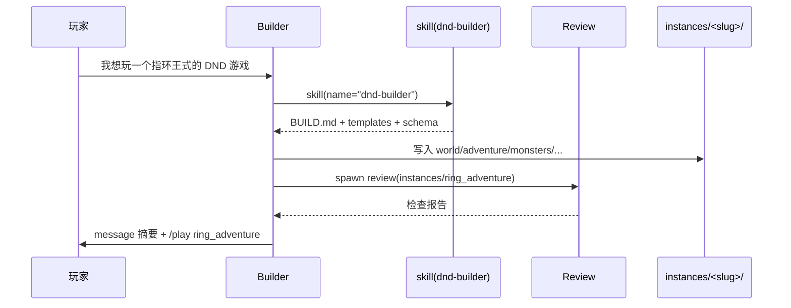
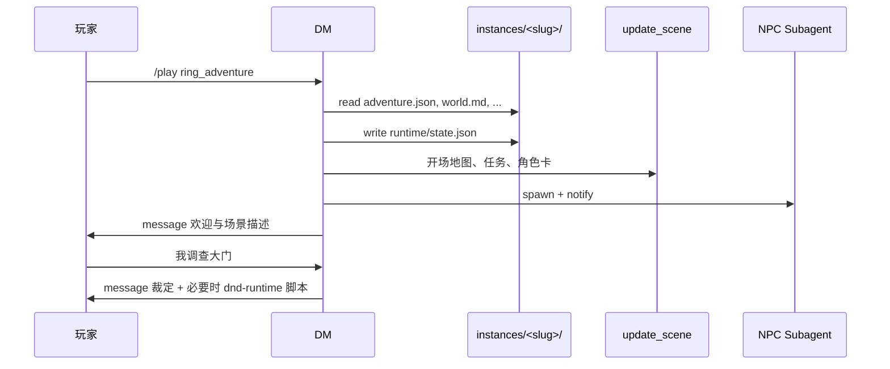

# DiceCraft：Builder / DM 分离 + DND Skill 化设计

> 日期：2026-05-31  
> 状态：已实现（2026-05-31）  
> 对应：`task_v3.md` 模块 D + 模块 E 的细化版

---

## 一、设计原则

| 原则 | 说明 |
|------|------|
| **Builder / DM 分离** | 两个独立 Agent prompt，通过 Session 模式切换，不共用同一套「既造又跑」指令 |
| **Builder 保持通用** | Builder 负责识别游戏类型、加载对应 Skill、按 Skill 规程产出资料；不硬编码 DND |
| **DND 内容 Skill 化** | DND 的构建规则、资料模板、校验清单放在 `skills/dnd/builder/`；每局游戏产物放在 `skills/dnd/instances/<slug>/` |
| **游玩读实例，不读 prompt** | DM / NPC 运行时读取 `instances/<slug>/` 下的结构化文件，而非仅靠对话历史「记住」设定 |

---

## 二、目录结构

### 2.1 模板（随 workspace 创建同步）

```text
templates/skills/
├── ...
├── ...
└── dnd/                           # 新增：DND 专用 Skill 包
    ├── SKILL.md                   # DND 总入口（description 供 skill 发现）
    ├── builder/                   # 子目录 ①：构建规则（静态，随模板下发）
    │   ├── SKILL.md               # 构建 Skill 入口（name: dnd-builder）
    │   ├── BUILD.md               # 构建工作流（步骤、slug 命名、信息分级）
    │   ├── review-checklist.md    # Review 子 Agent 检查项
    │   ├── templates/             # 单局资料模板（复制到 instances/<slug>/ 的骨架）
    │   │   ├── world.md
    │   │   ├── adventure.json
    │   │   ├── monsters.json
    │   │   ├── rules.md
    │   │   └── items.md
    │   └── schema.md              # 字段说明（玩家可见 vs DM 私有）
    ├── instances/                 # 子目录 ②：各局游戏实例（运行时写入）
    │   └── .gitkeep               # 模板中仅占位；实际内容由 Builder 生成
    └── runtime/                   # 子目录 ③：DND 游玩期工具（静态，随模板下发）
        ├── SKILL.md               # 游玩工具 Skill 入口（name: dnd-runtime）
        ├── RUNTIME.md             # 何时调用哪个脚本、与 read/write 的分工
        └── scripts/
            ├── roll.py            # d20 检定 / 豁免 / 攻击 / 伤害（输出 JSON）
            └── state.py           # 读写 instances/<slug>/runtime/state.json
```

> **与 `skills/dice/` 的关系**：`dice` 是独立示例桌游的 Skill，语义与接口均面向通用掷骰。DND 在 `skills/dnd/runtime/` 下自带脚本，DM 在游玩时通过 `bash` 调用，**不得**改用 `skills/dice/dice.py`。

### 2.2 运行时（workspace 内）

```text
data/workspaces/<ws_id>/skills/dnd/
├── builder/                       # 从 templates 同步，一般不改动
│   └── ...
└── instances/
    └── ring_adventure/            # Builder 根据玩家「指环王式」指令生成
        ├── meta.json              # 局元数据：title、slug、created_at、theme、status
        ├── world.md
        ├── adventure.json
        ├── monsters.json
        ├── rules.md               # 可引用 builder 默认规则或本局覆盖
        ├── items.md
        └── maps/                  # 可选：开场 CSV 等
            └── opening.map.csv
```

Session 级运行时状态（HP、线索是否揭示等）仍建议放在 **局内** 或 session 目录，避免污染 Skill 模板：

```text
skills/dnd/instances/<slug>/runtime/
└── state.json                     # DM 私有：当前 HP、quest 进度、revealed_clues
```

或沿用现有 `.game-state/`，但在 `meta.json` 中记录 `runtime_path`。

---

## 三、Agent 职责划分

### 3.1 Builder（`src/agent/prompt/builder.txt`）

**定位**：通用游戏构建者，**仅在 build 模式**作为 Primary Agent。

| 职责 | 说明 |
|------|------|
| 理解玩家意图 | 判断要构建的游戏类型（DND、骰子游戏、推理游戏等） |
| 加载 Skill | 用 `skill` 工具加载对应规程，如 `dnd-builder` |
| 按 Skill 构建 | 读取 `skills/dnd/builder/templates/`，写入 `skills/dnd/instances/<slug>/` |
| 质量检查 | `spawn_subagent` → `review`，传入实例路径 + `review-checklist.md` |
| 交付 | `message` 汇报摘要，告知玩家 `/play <slug>` |
| **不做** | 主持游玩、`update_scene`、spawn 游玩用 NPC（build 模式禁止） |

**DND 请求识别**（示例）：

- 「我想玩一个指环王式的 DND 游戏」
- 「帮我做一个 DND 冒险，中世纪奇幻」

→ 加载 `dnd-builder` Skill，theme=`lord_of_the_rings_style`。

**非 DND 请求**（保持通用）：

- 「做一个比大小的骰子游戏」→ 加载或创建 `skills/` 下其他 Skill / 自定义目录
- Builder prompt 中不写死 DND，只写「先判断类型，再 `skill` 加载对应 builder 规程」

### 3.2 DM（`src/agent/prompt/dm.txt`）

**定位**：游戏主持人，**仅在 play 模式**作为 Primary Agent。

| 职责 | 说明 |
|------|------|
| 绑定实例 | 系统注入当前 `activeGameSlug`，路径 `skills/dnd/instances/<slug>/` |
| 读取资料 | `read` world / adventure / monsters / rules / items |
| 初始化 | 写 `runtime/state.json`；`update_scene` 开场地图与任务 |
| 主持 | 描述场景、裁定行动；**必要时** `bash` 调用 `skills/dnd/runtime/scripts/`；`update_scene` 更新公开状态 |
| 加载游玩 Skill | 进入 play 模式后 `skill("dnd-runtime")` 获取脚本用法（`RUNTIME.md`） |
| NPC | 对 `important_npcs` → `spawn_subagent`(npc) + `notify`；不替 NPC 说话 |
| **不做** | 修改构建规则目录 `builder/`；不重新生成整局设定（除非玩家 `/build`） |

### 3.3 Review（`src/agent/prompt/review.txt`）

按游戏类型加载不同 checklist。DND 构建时：

- 读取 `skills/dnd/builder/review-checklist.md`
- 审查目标目录 `skills/dnd/instances/<slug>/`
- 输出结构化问题与修复建议（返回 Builder，不进玩家 chat）

### 3.4 NPC（`src/agent/prompt/npc.txt`）

游玩时由 DM spawn；spawn prompt 注入来自 **实例** 的 NPC 字段：

- `name`, `public_identity`, `personality`, `private_goal`, `known_information`
- 不读取其他 NPC 或 hidden_clues（除非 DM `notify`）

---

## 四、模式切换与 Session 状态

### 4.1 Session 字段（`SessionInfo` 扩展）

| 字段 | 类型 | 说明 |
|------|------|------|
| `gameMode` | `"build" \| "play"` | 默认 `build` |
| `activeGameSlug` | `string?` | 当前游玩实例，如 `ring_adventure` |
| `activeGameSkill` | `string?` | 可选，实例所属 Skill 包，默认 `dnd` |

### 4.2 切换方式

| 命令 | 行为 |
|------|------|
| `/play <slug>` | `gameMode=play`，`activeGameSlug=slug`，重建 App，DM 读取 `instances/<slug>/` |
| `/build` | `gameMode=build`，清空 slug，重建 App，回到 Builder |

校验：`instances/<slug>/meta.json` 或 `adventure.json` 必须存在。

### 4.3 代码触点（实现清单）

| 文件 | 改动 |
|------|------|
| `src/session/types.ts` | 增加 `gameMode`, `activeGameSlug`, `activeGameSkill?` |
| `src/session/manager.ts` | create/update 支持新字段 |
| `src/agent/registry.ts` | 注册 `dm` agent（非 primary，由 app 按模式选用 prompt） |
| `src/agent/prompt.ts` | `buildPrimarySystemPrompt(gameMode, slug, skill)` |
| `src/app.ts` | 按模式注入 Builder 或 DM prompt + 实例路径 |
| `src/server/ws.ts` | 解析 `/play`、`/build` |
| `src/server/app-pool.ts` | 传递 session 模式；`reset()`；`syncTemplates()` |

---

## 五、端到端流程

### 5.1 构建阶段（build 模式）



**Builder 步骤（写入 Skill 的 `BUILD.md`）**：

1. 解析主题 → 生成 slug（如 `ring_adventure`）
2. `skill("dnd-builder")` 加载构建规程
3. 复制 `builder/templates/*` → `instances/<slug>/` 并填充内容
4. 写 `meta.json`：`{ "title", "slug", "theme", "skill": "dnd", "status": "ready" }`
5. `spawn_subagent(review)` + checklist
6. `message` 交付

### 5.2 游玩阶段（play 模式）



---

## 六、DND Skill 包内容要求

### 6.1 `skills/dnd/SKILL.md`（总入口）

```yaml
---
name: dnd
description: DND-style tabletop adventures — builder rules and per-session instances under skills/dnd/.
---
```

说明目录结构：`builder/` = 构建规则，`instances/` = 各局游戏，`runtime/` = 游玩期脚本工具。

### 6.2 `skills/dnd/builder/SKILL.md`

```yaml
---
name: dnd-builder
description: Rules and templates for building a single DND adventure instance.
---
```

指向 `BUILD.md`、`templates/`、`schema.md`、`review-checklist.md`。

### 6.3 `builder/templates/` 最小字段

**world.md**：genre, tone, summary（玩家）, dm_private_lore（DM）

**adventure.json**：

| 字段 | 可见性 |
|------|--------|
| premise, quests[].player_visible_goal, maps[].description | 玩家 |
| hidden_clues, quests[].dm_private_goal, maps[].dm_private_notes | DM |
| important_npcs[] | 结构公开，私有字段仅 DM/NPC |

**monsters.json**：id, name, hp, stats, actions, tactics

**rules.md**：引用本 Skill 包内 `runtime/scripts/` 做 d20 检定与状态更新；简化战斗轮次

**items.md**：关键物品

### 6.4 `runtime/` — DND 专用工具脚本

DM（及必要时 Builder 做平衡自检）在**需要确定性计算或结构化状态变更**时，通过 `bash` 调用脚本；**叙事与读档**仍用 `read` / `message`，不强行脚本化。

#### `runtime/SKILL.md`

```yaml
---
name: dnd-runtime
description: DND play-time tools — d20 rolls and runtime state updates. Do not use skills/dice.
---
```

指向 `RUNTIME.md` 与 `scripts/`。

#### 脚本分工

| 脚本 | 用途 | Agent 何时调用 |
|------|------|----------------|
| `roll.py` | d20 属性检定、豁免、攻击、伤害；支持 advantage/disadvantage | 玩家行动需要判定时 |
| `state.py` | 读/写 `instances/<slug>/runtime/state.json`（HP、线索、任务进度） | 检定/战斗后更新状态，或开场初始化 |

#### 调用约定（经 `bash` 工具）

```bash
# 属性检定：1d20+3 vs DC 13
python skills/dnd/runtime/scripts/roll.py check --mod 3 --dc 13 --reason "Perception"

# 优势检定
python skills/dnd/runtime/scripts/roll.py check --mod 3 --dc 13 --advantage

# 攻击 vs AC 15，伤害 1d8+3
python skills/dnd/runtime/scripts/roll.py attack --attack-mod 5 --ac 15 --damage "1d8+3"

# 读取运行时状态
python skills/dnd/runtime/scripts/state.py get --instance ring_adventure --path party.0.hp

# 写入运行时状态（脚本内校验 JSON schema，避免 LLM 手写 JSON 出错）
python skills/dnd/runtime/scripts/state.py set --instance ring_adventure --path party.0.hp --json 8
```

**输出**：各脚本 stdout 打印 **单行 JSON**，便于 Agent 解析后 `message` 告知玩家，并决定是否 `update_scene`。

示例 `roll.py` 输出：

```json
{"kind":"check","notation":"1d20+3","rolls":[12],"modifier":3,"total":15,"dc":13,"success":true,"reason":"Perception"}
```

#### 与文件工具的分工

| 操作 | 推荐方式 |
|------|----------|
| 读设定（world、adventure、monsters） | `read` |
| 写构建产物（Builder 生成实例） | `write` / `edit` |
| 掷骰、伤害、与规则绑定的数值判定 | `bash` → `runtime/scripts/roll.py` |
| 更新 HP、任务进度、线索 revealed | `bash` → `runtime/scripts/state.py`（或初始化时 `write` 整文件） |
| 玩家可见地图/任务/角色卡 | `update_scene` |

### 6.5 `instances/<slug>/meta.json`

```json
{
  "slug": "ring_adventure",
  "title": "Shadows Over the Shire",
  "theme": "lord_of_the_rings_style",
  "skill": "dnd",
  "status": "ready",
  "created_at": "2026-05-31T12:00:00.000Z"
}
```

---

## 七、与现有系统的关系

| 已有能力 | 本设计中的用法 |
|----------|----------------|
| `skill` 工具 | Builder 加载 `dnd-builder`；DM 加载 `dnd-runtime` |
| `bash` 工具 | DM 调用 `skills/dnd/runtime/scripts/*.py` |
| `spawn_subagent` | Builder → review；DM → npc |
| `notify` / `message` | DM 控制信息流与玩家可见对话 |
| `update_scene` | DM 仅 play 模式更新 UI |
| `WorkspaceManager` + templates | 同步 `skills/dnd/builder/`；`instances/` 仅 `.gitkeep` |
| WebUI 聊天 + 场景画布 | 无需改 UI；模式用 `/play` `/build` |

**不改动**：

- `docs/api_doc.md` 不强制 DND schema（实例走 workspace 文件）
- Builder 对非 DND 游戏仍可走其他 Skill 或自定义 `skills/<name>/`

---

## 八、验收标准

### 8.1 构建（模块 D）

- [ ] 输入「我想玩一个指环王式的 DND 游戏」后，`skills/dnd/instances/<slug>/` 下生成完整文件集
- [ ] 产物含 `meta.json`，且玩家可见 / DM 私有字段符合 `schema.md`
- [ ] Review 能指出故意植入的错误（测试用 fixture）
- [ ] Builder 在 build 模式不调用 `update_scene`、不 spawn 游玩 NPC
- [ ] 输入非 DND 需求（如「骰子比大小」）仍可构建，不强制走 dnd-builder

### 8.2 游玩（模块 E）

- [ ] `/play <slug>` 后 DM 读取对应 instance，完成开场（scene + message）
- [ ] 至少 1 个 important NPC 由 Subagent 扮演，可多轮 `notify`
- [ ] 隐藏线索未揭示前不出现在 `message` / `update_scene`
- [ ] 检定/攻击通过 `skills/dnd/runtime/scripts/roll.py`（**未**调用 `skills/dice`）
- [ ] HP/任务/线索变更通过 `state.py` 或规范路径写入 `runtime/state.json`
- [ ] `/build` 可回到构建模式

---

## 九、实现顺序建议

| 顺序 | 任务 | 产出 |
|------|------|------|
| 1 | 创建 `templates/skills/dnd/`（builder + runtime/scripts） | Skill 资产 + DND 工具脚本 |
| 2 | 拆分 `builder.txt` / `dm.txt`，实现 Session 模式与 `/play` | 双 Agent 流程 |
| 3 | 改写 `review.txt` + checklist 接入 | 构建质检 |
| 4 | Builder prompt 引导 `skill(dnd-builder)` + 写 instances | 端到端构建 |
| 5 | DM prompt 引导读 instances + scene + NPC | 端到端游玩 |
| 6 | 测试 fixture + 文档更新 | 可演示、可反驳「只是提示词」 |

---

## 十、演示话术（答辩用）

> 指环王式 DND 不是一句 prompt 变出来的。玩家说出主题后，**Builder** 会加载 **`dnd-builder` Skill**，在 workspace 里生成 **`skills/dnd/instances/ring_adventure/`** 结构化实例。玩家 `/play` 之后，**DM** 读取实例主持，**NPC** 按实例设定回复；检定与状态更新走 **DND 自带的 `runtime/scripts/`**（与示例桌游 `skills/dice` 无关）。prompt 管流程，**实例文件管内容，脚本管可复现的数值与状态**。
