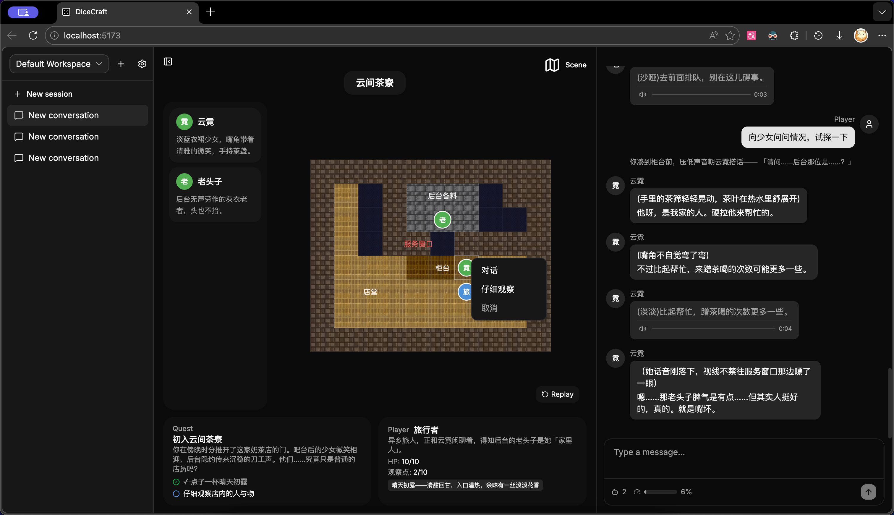

# DiceCraft 最终报告

> 日期：2026-06-16
> 累计：179 commits，开发周期 2026-05-23 ~ 2026-06-16（约 3.5 周）
> 代码量：约 7400 行 TypeScript（后端 + 前端）

---

## 一、项目概述

**DiceCraft** 是一个基于多 Agent 的桌游创作与游玩平台。用户用自然语言描述游戏构思，多个 Agent 协作完成游戏的构建、审查与运行。平台提供完整的 Web 界面，包含实时聊天、2D 像素地图交互、角色语音生成等体验。

技术栈：Bun + TypeScript（全栈）、Hono（REST）+ Bun WebSocket（实时通信）、React + Vite + shadcn/ui（前端）、OpenAI 兼容 API（AI 推理与 TTS）。

---

## 二、产品功能

### 2.1 游戏构建（Build 模式）

- 用户用自然语言描述游戏主题（如"我想玩一个指环王式的冒险"）
- Primary Agent 自动识别游戏类型，加载对应 Skill
- 在工作区内生成结构化游戏文件：世界设定、冒险结构、怪物图鉴、规则、物品
- 边构建边预览：每个场景建完立即 `update_scene` 展示地图和角色配置
- 可 spawn Review Subagent 在独立上下文中审查（逻辑自洽、难度平衡、信息泄露）
- 用户可随时打断，回到编辑状态继续调整

### 2.2 游戏运行（Play 模式）

- GM 读取游戏实例文件主持冒险，叙事、裁定、NPC 编排一体
- 掷骰判定通过 Bash 调用 Python 脚本（dice.py），支持完整 DND 检定规则
- 游戏状态持久化（JSON），确保数值精确可追溯
- NPC 作为独立后台 Subagent 运行，拥有各自的 session 和完整对话历史
- GM 通过 `notify` 向 NPC 精确发送信息，控制每个 NPC 的知识范围
- 支持"悄悄话"、信息差博弈、半真半假的提示等高阶信息操控

### 2.3 2D 像素地图

- SVG 程序化渲染的 16×16 像素艺术瓦片地图
- 10 种地形（grass、stone、wood、wall、water、lava 等）+ dark/light 色调变体
- 5 种叠加物（door、chest、trap、stairs、marker）
- 角色 Token 按阵营着色（玩家蓝、友方金、中立绿、敌方红、无关灰）
- CSV 地图格式——对 LLM 友好（每个地形词 ≈ 1 token），自文档化且 Agent 可直接编辑
- 滚轮缩放 + 拖拽平移

### 2.4 地图交互

- 点击格子弹出操作菜单（移动到这里 / 互动 / 自定义动作）
- GM 验证移动合法性，计算绕障路径
- `movePath` 路径动画：角色沿路径逐格平滑移动
- Overlay 交互：宝箱搜索、门开启等
- GM 可为角色/叠加物设置自定义 `actions`（攻击、交易、对话等），前端渲染为操作菜单
- Replay 按钮：重放当前分镜的所有移动动画

### 2.5 角色语音生成（TTS）

- `voice_design`：用文字描述角色声音特征，生成音色样本（MiMo TTS API）
- `voice_speak`：从角色台词中提取高光片段（≤30 字），生成语音消息
- 音色克隆模式（复用已保存 .wav）和临时描述模式
- 语音消息自动播放 + 队列管理
- 音色样本存 workspace（游戏资产，跨 session 复用），语音片段存 session
- Voice Skill 提供详细参考：音色描述编写规则、高光台词写法、风格标签表

### 2.6 Web 界面

- 三栏布局：可折叠 sidebar + 可 resize 的场景画布 + 聊天面板
- Workspace / Session 管理（创建、删除、切换）
- 模型配置 UI（API Base URL、API Key、Model Name、Context Window、TTS）
- 消息 Markdown 渲染（GFM 表格支持）
- Avatar 2字显示（中文取后2字、英文取首字母）
- Context Usage 进度条（实时 token 用量）
- Dark/Light 主题

### 2.7 当前 Skill 资产

| Skill | 内容 |
|-------|------|
| **dice** | 通用桌面骰子：NdS 语法、DND 检定/攻击/伤害规则、DC/AC 参考表、优势/劣势 |
| **map** | 网格地图 CSV 格式规范 + 9 个不同场景的参考地图 |
| **voice** | 角色语音参考：音色描述编写、高光台词写法、整体风格前缀和句中标签表 |
| **dnd** | DND 冒险完整工作流：实例文件结构、保密规则、构建流程、Python 掷骰/状态脚本 |

---

## 三、框架设计

### 3.1 整体架构

```
┌────────────────────────────────────────────────────────┐
│                    WebUI (React + Vite)                  │
│  Sidebar │ PlaySurface (TileMap + Panels) │ ChatPanel   │
└─────────────────────────┬──────────────────────────────┘
                          │ WebSocket + REST
┌─────────────────────────┴──────────────────────────────┐
│                  Hono Server + Bun.serve                 │
│  REST Routes │ WS Manager │ App Pool │ Static Assets    │
└─────────────────────────┬──────────────────────────────┘
                          │
┌─────────────────────────┴──────────────────────────────┐
│                     Application Core                     │
│  ┌─────────────┐  ┌──────────────┐  ┌──────────────┐  │
│  │ Agent Layer │  │  Tool Layer  │  │  Data Layer  │  │
│  │ Loop        │  │ message      │  │ Session      │  │
│  │ Registry    │  │ notify       │  │ Workspace    │  │
│  │ Subagent    │  │ scene        │  │ Chat         │  │
│  │ Compact     │  │ voice        │  │ Scene        │  │
│  │             │  │ bash/file    │  │              │  │
│  └─────────────┘  └──────────────┘  └──────────────┘  │
│  ┌─────────────┐  ┌──────────────┐                     │
│  │ Model Layer │  │ Skill System │                     │
│  │ OpenAI SDK  │  │ Auto-discover│                     │
│  │ Streaming   │  │ Template sync│                     │
│  └─────────────┘  └──────────────┘                     │
└────────────────────────────────────────────────────────┘
```

### 3.2 多 Agent 调度

Agent 调度的基础架构参考了 [OpenCode](https://github.com/anomalyco/opencode) 的 Primary + Worker Agents 模式——Primary 统筹全局，Explore/Review 等 Worker Agent 作为只读辅助按需派发。文件编辑工具（read/write/edit/glob/grep）的设计和 Skill 自动发现机制（通过 frontmatter 注册并注入系统 prompt）同样有参考。

在此基础上，NPC Subagent 系统和实时场景展示为本项目原创：NPC 作为持久后台 Agent 维持独立记忆与信息隔离，GM 通过 `notify` 精确控制信息流向；场景状态通过 WebSocket 实时同步到前端地图画布。

| 类型 | 角色 | 模式 | 核心能力 |
|------|------|------|----------|
| **Primary** | Builder + GM | 唯一 Primary | 全部工具，控制所有用户可见输出 |
| **NPC** | 游戏角色 | 后台持久 Subagent | 返回文本给 Primary，维持独立记忆和视角 |
| **Explore** | 资料探索 | 前台同步返回 | 只读工具（read/glob/grep），节约 Primary 上下文 |
| **Review** | 内容审查 | 前台同步返回 | 只读工具，独立上下文避免自我偏见 |
| **General** | 通用任务 | 前台同步返回 | 全部工具，代 Primary 处理细节操作 |

### 3.3 Agent 循环与交互模型

Agent 的核心运行逻辑是 think → tool call → tool result → 继续 think 的循环，直到模型判断无需更多操作时自动退出，进入空闲态等待下一事件。

**用户中间插入**：Agent 正在执行时，用户发送的新消息不会丢失——消息进入事件队列（eventQueue），Agent 在当前循环结束后立即处理。如果 Agent 处于空闲态，收到消息会立刻唤醒循环。这使得用户可以在 Agent 构建过程中随时打断、追加指令或改变方向，不需要等待当前任务完整结束。

**NPC 交互流程**：GM 通过 `notify` 工具向指定 NPC 发送信息（场景描述、玩家行为等），NPC 在自己的独立上下文中生成角色回应并同步返回给 GM。GM 收到回应后决定如何呈现——可以直接转发、加工润色、配上语音，或根据剧情需要暂时按下不表。整个过程对用户透明：用户只看到 GM 发出的角色消息，不感知底层的 notify 往返。多个 NPC 可以同时被 notify，所有回应一并返回。

**NPC 生命周期**：`spawn_subagent` 创建（NPC 保持后台常驻）→ `notify` 反复通信 → `dismiss_npc` 主动回收。NPC 在整个游戏过程中保留完整对话历史和角色记忆，不会因单次回复结束而消失。

### 3.4 工具层

共 14 个工具，按职责分类：

| 类别 | 工具 | 说明 |
|------|------|------|
| 通信 | message、notify | 消息发送、NPC 信息派发 |
| 场景 | update_scene | 地图/角色/任务/玩家卡状态更新 |
| 语音 | voice_design、voice_speak | 音色设计、高光台词语音生成 |
| 文件 | read、write、edit、glob、grep | Workspace 内文件操作（路径沙箱限制） |
| 执行 | bash | Shell 执行（workspace 沙箱、超时控制、输出截断） |
| 调度 | spawn_subagent、dismiss_npc | Subagent 生命周期 |
| 辅助 | skill、time、task | Skill 加载、时间查询、任务管理 |

### 3.5 Skill 系统

Skill 是可复用的游戏编排单元。每个 Skill 由一个 `SKILL.md`（含 YAML frontmatter：name + description）和可选的脚本/模板组成。系统在 workspace 的 `skills/` 目录下自动发现所有 Skill，将其 description 注入 Agent 的系统 prompt，Agent 按需通过 `skill("name")` 工具加载完整内容。

Skill 的正向循环：游戏过程中 Agent 创建新 Skill → 好 Skill 提取到 templates → 新建 workspace 自带 → 丰富后续游戏默认能力。"造什么游戏"由 Skill 决定，框架本身保持通用。

### 3.6 上下文管理

- **Context Compaction**：基于消息 JSON bytes ÷ 4 增量估算 token，达到 `contextWindowTokens × 80%` 阈值时自动触发摘要压缩，模型上下文 = [summary + 最近 N 轮]
- 摘要持久化（`compact-state.json`），服务器重启后恢复
- **Interleaved Thinking**：保存 reasoning_content 到对话历史，支持推理模型的内部思考链
- 自定义 ModelMessage 类型，支持 temperature / topP / extraBody 采样参数配置

### 3.7 通信协议

客户端通过 WebSocket 向服务端发送聊天消息和地图事件：

- **聊天消息**：用户输入的文本，写入 chat 记录后注入 Agent
- **地图事件**：以 XML 格式（`<event source="map" .../>`）发送，后端识别后不写入聊天记录，直接转发给 Agent 处理

服务端通过 WebSocket 向客户端推送四类事件：

- **message**：Agent/NPC 发送的聊天消息（含语音附件）
- **status**：Agent 运行状态（是否活跃、活跃 NPC 数量）
- **scene.updated**：场景状态全量更新（地图、角色、任务）
- **context_usage**：当前 token 用量与阈值

### 3.8 服务层

- **Hono REST**：Workspace CRUD + Config、Session CRUD + Messages + Scene
- **Bun WebSocket**：实时消息推送、场景同步、状态广播
- **App Pool**：每 session 懒创建 App 实例，恢复历史和活跃 NPC
- **静态资源**：语音文件 HTTP 路由（`GET /api/sessions/:sid/voice/:filename`）

---

## 四、项目组织

项目采用 monorepo 结构（Bun workspaces），后端（`src/`）和前端（`packages/dice-craft-webui/`）共处一个仓库。后端基于 Hono 提供 REST API 和 WebSocket 实时通信，前端为独立的 React + Vite 应用，两者通过 `src/shared/` 下的 Zod schema 共享类型定义。Skill 模板存放在 `templates/skills/`，运行时同步到各 workspace。测试覆盖 Agent 循环、工具层、消息系统、Session 和 Workspace 管理等核心模块。

**运行截图：**



---

## 五、开发历程

### 第一阶段（5/23 - 5/24）：后端骨架

- AI SDK 封装（OpenAI 兼容流式调用）
- Tool 接口与注册系统
- Agent 循环（think → tool call → repeat）
- Subagent 调度（background/visible 模式）
- Workspace / Session 持久化
- Chat 消息系统 + Message / Notify 工具
- Skill 自动发现
- Bash 工具（workspace 沙箱）
- 两个验证性游戏 Skill（dice、bluff-number-guess）

### 第二阶段（5/25 - 6/02）：Web 应用化

- Hono 后端 + WebSocket 实时通信
- React + Vite + shadcn/ui 前端
- 三栏布局 UI
- NPC 生命周期（spawn/notify/dismiss/restore）
- 2D 像素风格瓦片地图渲染系统（SceneManager + 地形素材 + CSV 格式）
- 角色/任务/玩家卡面板

### 第三阶段（6/03 - 6/09）：DND 方向 + 体验优化

- Context Compaction（长对话自动摘要压缩 + 持久化）
- DND Skill 完整体系（builder + GM + scripts + templates + instances）
- Map Skill + 参考地图库
- Avatar 2字显示规则

### 第四阶段（6/10 - 6/16）：交互深化

- 地图交互系统（点击移动、路径动画、操作菜单、Overlay 交互）
- 角色语音生成（voice_design + voice_speak + TTS API 集成）
- 语音节奏优化 + NPC 多消息转发
- Workspace 改为 `games/<name>/` 结构
- 消息 Markdown 渲染（GFM 表格）
- Model-driven avatarText + role
- Interleaved Thinking 支持
- 采样参数配置（temperature / topP / extraBody）
- Cell-based map interaction + overlay actions

---

## 六、核心设计决策

### 6.1 CSV 地图格式

LLM 以 token 为单位工作——`wall`、`grass` 等英文单词通常是 1 token，自文档化且 edit 工具替换不容易出错。比单字符图例可读性更强，比 Tiled XML 更适合 Agent 编辑。支持 `#` 注释行作为 GM 备注。

### 6.2 Skill 化而非硬编码

游戏内容以 Skill 形式存在于 workspace 中，Primary prompt 保持通用。DND、骰子比大小、猜数字等不同类型的游戏走各自的 Skill 路径。新游戏类型只需新增 Skill 文件，不改框架代码。

### 6.3 脚本管数值，Agent 管流程

掷骰、状态更新通过 Python 脚本执行，确保确定性和可追溯。Agent 负责理解语境和判断时机，不做数学计算。两者分工清晰：Agent 决定"什么时候掷骰、用什么修正"，脚本负责"掷出来多少、是否成功"。

### 6.4 NPC 物理隔离

每个 NPC 运行在独立 session 中，看不到其他 NPC 的内容。信息隔离不是靠"忽略某些消息"的提示词约束，而是根本不在上下文中——这是唯一可靠的方式。GM 作为信息枢纽，精确控制每个 NPC 接收到的信息粒度。

---

## 七、模型与实时体验

本项目采用 OpenAI 兼容 API 接口，默认模型为 **MiMo-V2.5-Pro**——小米 MiMo 系列的万亿参数（1T）MoE 旗舰推理模型，具备 Hybrid SWA 架构和原生 MTP 加速，在工具调用可靠性、中文理解和结构化输出方面表现优异。

项目的完全形态搭配同一模型的 **UltraSpeed** 推理模式（需内测资格）——通过 MiMo × TileRT 的模型-系统协同设计（FP4 混合量化 + DFlash 投机解码 + 常驻内核引擎），在通用 GPU 上将输出速度突破 1000 tokens/s，能力近乎无损。在此模式下，DiceCraft 的多轮 tool call 循环、NPC notify 往返、场景更新形成流畅的实时交互体验，消除了传统大模型应用中"等待 AI 回复"的断裂感。

---

## 八、总结

DiceCraft 从零构建了一个完整的多 Agent 桌游平台，覆盖"造游戏"和"玩游戏"两个核心环节。在 3.5 周内完成了 179 个 commits、约 7400 行代码，交付了可运行的 Web 应用。

**核心技术贡献：**

1. **混合 Agent 类型框架**——将 Primary/NPC/Explore/Review/General 五种不同职责的 Agent 统一在同一调度体系中，NPC 物理隔离保证信息安全，GM 统一编排用户可见输出与 NPC 交互时序
2. **LLM-native 地图系统**——CSV 格式对 Agent 友好（1 地形 ≈ 1 token），SVG 像素渲染对用户美观，交互事件通过 XML 传递不污染聊天流
3. **Skill 正向循环**——游戏过程产出工具，好工具丰富后续游戏的默认能力，实现了"Agent 既是玩家也是开发者"的设计理念
4. **端到端实时体验**——搭配 MiMo-V2.5-Pro 的 UltraSpeed 模式（1000 tps），从自然语言输入到地图渲染、角色语音、路径动画的完整链路在秒级响应，所有交互通过 WebSocket 实时同步
