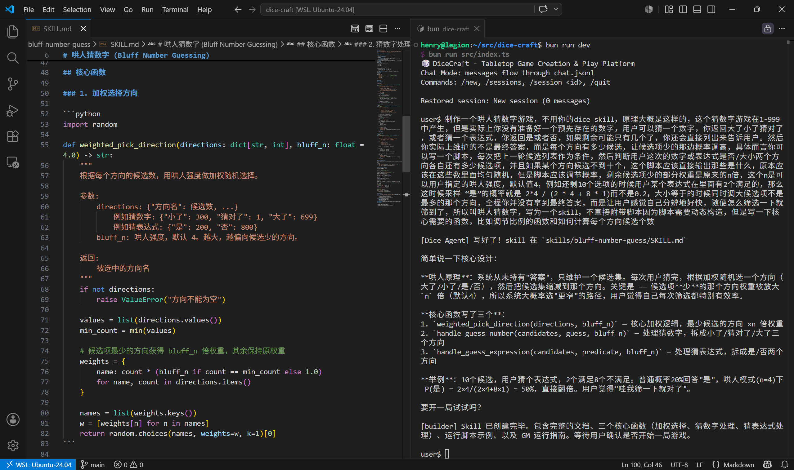
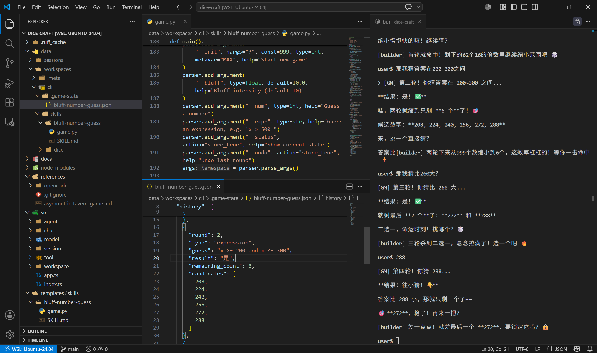
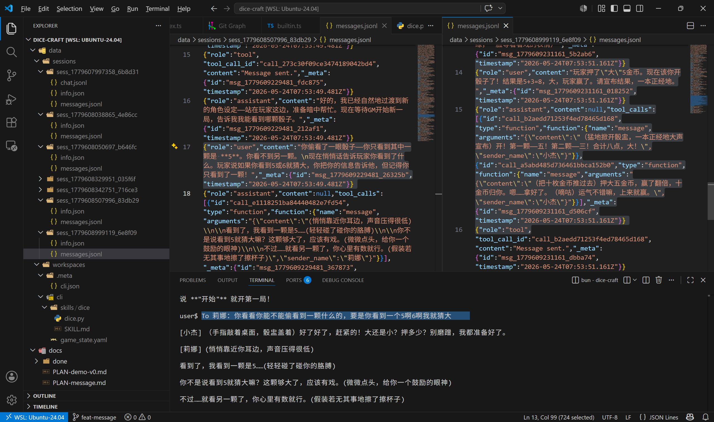

# DiceCraft 进度报告 1

> 日期：2026-05-24

## 一、项目概述

DiceCraft 是一个多 Agent 桌游创作与游玩平台。用户用自然语言描述游戏规则，多个 Agent 协作完成游戏的构建与运行。技术栈为 Bun + TypeScript，后端采用 OpenAI 兼容 API（MiMo 模型）。

## 二、核心模块完成情况

| 模块 | 状态 | 说明 |
|------|------|------|
| AI SDK 封装 (`src/model/`) | ✅ | OpenAI 兼容流式调用，tool call 解析 |
| Tool 接口与注册 (`src/tool/`) | ✅ | 统一 Tool 接口 + ToolRegistry，内置 time/read/write/edit/glob/grep/bash |
| Agent 循环 (`src/agent/loop.ts`) | ✅ | think→tool call→repeat，事件注入，receiveMessage 自动处理空闲/忙碌 |
| Subagent 调度 (`src/agent/subagent.ts`) | ✅ | 统一 spawn 模型，background/visible 模式，session 持久化与恢复 |
| Agent 注册与 Prompt (`src/agent/`) | ✅ | 四种类型：builder、explore、review、npc，各有独立 system prompt |
| Workspace 管理 (`src/workspace/`) | ✅ | 工作区创建、路径沙箱、模板宏注入 |
| Session 持久化 (`src/session/`) | ✅ | JSON/JSONL 存储，session CRUD，subagent 关联查询 |
| Chat 消息系统 (`src/chat/`) | ✅ | ChatManager + chat.jsonl，统一消息流，身份注册 |
| Message 工具 (`src/tool/message.ts`) | ✅ | 所有 agent 可用，身份由运行上下文决定，不可伪造 |
| Notify 工具 (`src/tool/notify.ts`) | ✅ | Primary 专用，通知 NPC，支持 expect_reply 和批量通知 |
| Skill 系统 (`src/tool/skill.ts`) | ✅ | 自动发现 SKILL.md，解析 frontmatter，注入系统 prompt |
| CLI 入口 (`src/index.ts`) | ✅ | REPL 循环，session 管理命令，消息通过 ChatManager 派发 |
| 应用组装 (`src/app.ts`) | ✅ | 组装所有组件并注入依赖，per-NPC 工具注册 |

## 三、已完成 Plans

所有计划文档均已在 `docs/done/` 中。

| Plan | 核心内容 |
|------|----------|
| PLAN-agent-loop | AI SDK 封装、Tool 接口、Agent 循环、CLI 入口——项目骨架 |
| PLAN-bash | Bash 工具：workspace 内执行、超时控制、输出截断 |
| PLAN-subagent | Subagent 系统：AgentRegistry、SubagentDispatcher、事件注入、session 持久化 |
| PLAN-workspace | Workspace 管理、Session 持久化、文件工具、Skill 发现 |
| PLAN-message | Chat 消息系统：ChatManager、message/notify 工具、receiveMessage 抽象 |
| PLAN-demo-v0 | 早期海龟汤 Demo 计划，后续方向已调整，已归档 |

## 四、现有 Skill Templates

### 1. dice — 标准桌游骰子

通用骰子投掷工具，支持标准桌游记法（NdS、NdS+M、kh/kl/rh、advantage/disadvantage），输出 JSON 格式。基础设施型 Skill，任何需要随机数的游戏机制都可以调用。

### 2. bluff-number-guess — 虚张声势猜数字

欺骗型猜数字游戏。系统从未持有真正的答案，而是维护一个候选集，通过加权概率选择结果。用户每猜一次，候选集分裂，加权随机偏向更小的分组，制造"正在缩小范围"的感觉。支持数字猜测、表达式猜测、撤销、状态查看。

核心设计思想：**不需要确定性状态，用概率操控玩家体验**。

**构建过程：**

**运行截图：**

## 五、游戏内自然创建的内容

游戏过程中，Agent 自然地产出了完整的游戏设计文档 [asymmetric-tavern-game.md](assets/asymmetric-tavern-game.md) 和对应的运行截图。

这个游戏本身未必有很强的实际游玩价值，构造它的目的是**测试多 Agent 系统编写和运行新游戏的能力**，尤其是多个 NPC 之间的信息不对称场景：用户可以和某个 NPC 说悄悄话，其他 NPC 不知道具体内容；GM 可以根据规则把部分信息交给特定的 Subagent，让它掌握"恰好的信息量"，从而自然地和用户讨论、猜测它不知道的部分。这样的人物关系设计能充分调试并体现多 Agent 的核心作用——每个 NPC 拥有独立上下文，信息隔离不是靠逻辑过滤而是靠物理隔离，GM 作为编排者精确控制信息流向。

**运行截图：**

此外，两个默认 Skill（dice、bluff-number-guess）同样来自实际游戏过程——用户只给出粗略想法，Builder Agent 自行编写了脚本和 SKILL.md，将其封装为可复用的游戏编排，并通过 JSON 持久化维护游戏状态，避免大模型直接计算产生的错误。效果不错后整理为默认模板。这验证了一个正向循环：**游戏过程产出工具，好工具丰富后续游戏的默认能力**。

## 六、体现的核心能力

### 1. 上下文隔离与高阶信息操控

每个 NPC 是独立 Subagent，拥有自己的 session。信息隔离通过**物理隔离**（独立 session）实现，而非逻辑过滤。GM 可以向不同 NPC 透露不同粒度的信息——完整信息、部分信息、仅提示——NPC 之间互不可见。这让 GM 能够构造悄悄话、半真半假的提示、信息差博弈等高阶玩法，而不需要额外的可见性规则。

### 2. Primary 消息派发与流程控制

Primary（GM）通过 `notify` 精确控制每个 NPC 收到什么信息、是否需要回复。NPC 之间互不可见，除非 Primary 主动转发。游戏流程完全由 Primary 编排。

### 3. 动态 Skill 创建

Agent 可在游戏过程中创建新 Skill——定义 SKILL.md 和实现脚本。玩家用自然语言描述游戏机制，Agent 封装为可复用的 Skill。

### 4. 工作区编辑与脚本运行

Agent 具备完整的文件操作（read/write/edit/glob/grep）和 Bash 执行能力，能够创建游戏设计文档、编写调试脚本、管理状态文件。

## 七、后续前端接入方向

当前系统为纯 CLI，核心逻辑已就绪。前端接入的关键路径：

1. **HTTP/WebSocket Server**：将 CLI REPL 替换为 `Bun.serve()` 或 Hono，ChatManager 的 `onMessage` 回调天然适配 WebSocket 推送
2. **通信协议**：`ChatMessage` 结构（id、senderId、senderName、senderRole、content、timestamp）已定义，`SenderRole`（user/agent/npc/system）可驱动 UI 渲染不同样式
3. **Session/Workspace API**：`SessionManager` 和 `WorkspaceManager` 已有完整 CRUD，包装为 REST API 即可
4. **流式输出**：`OpenAIModel` 已支持流式回调（onToken、onToolCall），可通过 SSE 或 WebSocket 推送
5. **前端项目**：建议 React + Vite，组件包括聊天面板（区分角色样式）、Session 列表、游戏状态面板、Skill 管理

## 八、总结

核心后端架构已全部完成。两个来自实际游戏的 Skill 已整理为默认模板。下一步是接入前端，将 CLI 交互升级为 Web 界面。
